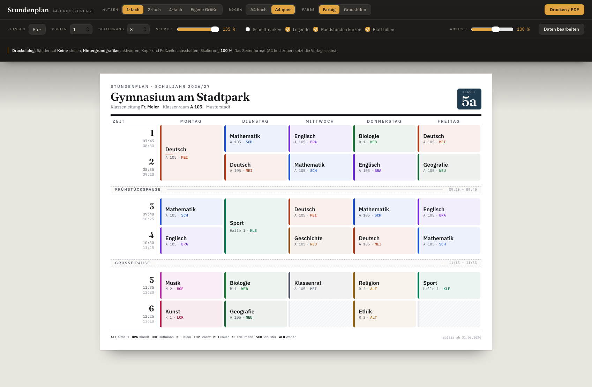

# Stundenplan

Stundenplan ist ein HTML-Seite, die im Webbrowser einen Stundenplan im JSON-Format in verschiedenen Druck-Layouts ausgeben kann.

https://mksdc.github.io/stundenplan

## Funktionen
- Lesen und Speichern von Daten im JSON-Format. [Beispieldaten](stundenplan-daten.json)
- Editor für Wochentage, Zeitraster, Klassen & Pläne, Legende Lehrerkürzel und Fächerfarben, JSON-Editor
- Ausgabe DIN A4 Hoch- oder Querformat, farbig oder in Graustufen
- 1-fache, 2-fache, oder 4-fache Ausgabe pro Seite
- Eigene Größe in mm x mm
- Schnittmarken
- Legende Lehrerkürzel

## Probleme
- Druckausgabe iOS beeinträchtigt Layout durch Kopf- und Fußzeile
